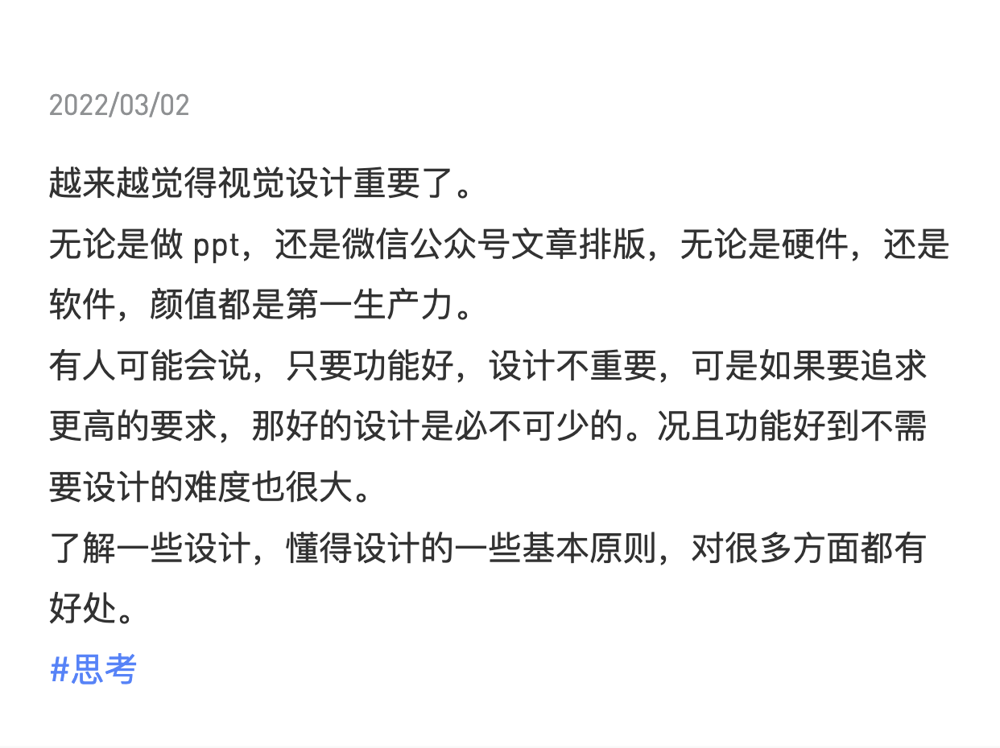

# 用 mdnice 和 tailwindcss 给微信公众号排版

## 缘起

几天前，无意间看到了[卡颂](https://mp.weixin.qq.com/s/0W75vJ0CXt3JR7ua8ZOuFA)的微信公众号推送的文章，虽然之前已经看过，但是这次却被他的排版吸引了。且不论内容，这样的 **设计** 就让人很有看下去的欲望。有感而发，当即在 flomo 里写下了下面一段话：

接着找了几本讲 **UI** 设计的书籍，打算从里面学一些通用的用户界面设计技巧，一方面提高自己的审美水平，一方面以备不时之需。

总结一下最基础的一些设计元素：

- **间距 spcae**，即设计中每个对象之间的距离。
- **文字 font**，包含字体、大小、字重和行高等等。
- **颜色 color**，可以分为灰色，基础色，强调色。

这些是你一开始在做界面设计的时候就要定好的。在我看来，做好了这些，就成功了一半。引用书里说的一句话：

> With design, less is always more.

## 过程

理念是学得差不多了，接下来就得实践了。

首先是搞清楚微信公众号如何排版。微信是用富文本排版的，其实就是 **html + inline style**。

如果直接用 html 会很不方便，所以已经有很多开源的方案采用渲染 **markdown** 的方式来做。

一开始还想要不要自己做一个，经过研究，发现事情并不简单，有很多坑需要重新踩一遍，得不偿失。对比之后，我最后选择了 **mdnice**。

工具选好了，下一步就是开始设计了。

我想起了之前用的 **tailwindcss** 正好包含了前面提到的那三个基础的设计元素，并且设计精良。虽然不能直接用它来写 css，但是参考它的设计就可以节省很多时间了。

做的过程还算顺利，也遇到了几个问题：

1. 多级引用感觉不是很常用，暂时忽略。
2. table 样式复制不到公众号，暂时没有解决办法。
3. 删除线无法工作，暂时 html 代替。

## 优化

大体排版完之后，发现了几个值得优化的点。

**第一个是标题的样式。**

一开始我把标题的颜色设置为基础色，但是一旦标题相邻很近的话，颜色感觉就聚拢一团了，会产生很拥挤的感觉。于是我把它改成了和正文一样的颜色，这样看起来就不会喧宾夺主了。另外感觉纯文字的标题始终有些单调，但是暂时也没有找到好的样式。

**第二个是背景。**

很多公众号都流行一种格子背景，视觉效果确实好。为了稍微显得不同，我找了找其他的类似的背景模式，找到了这个专门用 css 来实现 [partten 背景](https://www.magicpattern.design/tools/css-backgrounds "partten 背景") 的网站。最后选了一个反斜线的，效果也还行。

**第三个是一致性。**

把样式里面用到的圆角、阴影的样式都做了统一，看起来更和谐。

## 总结

好了，这基本就是全部内容了，但这只是个开始，其实还有很多值得改进的地方，接下来在慢慢的弥补未尽的遗憾吧。
